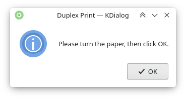
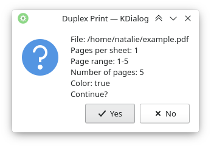

# Automatic Manual Duplex Printing

Shell script to semi-automatize manual two-sided printing for printers whose hardware or driver doesn’t support autonomous duplex printing, by splitting up the print request into one print job for the odd pages and one for the even pages, and prompting the user to turn the paper in between.

The purpose of the script is to take over the work of handling the front and back pages separately. It uses ` lp` to send the print requests, and does not provide any printer driver functionality.

Supported printing options are: page range in the form of start - end (not multiple page ranges), multiple pages per side, color mode (color, gray scale). Odd and even pages are determined relative to the selected page range rather than the file page numbers, so that the first page to be printed appears on the front side.

The script comes in a command line version and a simple KDE-based graphical interface version.

## Installation

### Command-line interface version

1. Make sure dependencies are installed: `awk`, `grep`, `lp`, `pdfinfo`, `sed`.
2. Download and unpack `lpd_cli.sh`.
3. Make it executable: `chmod u+x lpd_cli.sh`
4. (optional) Add an alias for easy access:
   - Add to `~/.bashrc`: `alias lpd='path-to-the-script/lpd_cli.sh'`.

### Graphical interface version

1. Make sure dependencies are installed: `awk`, `grep`, `lp`, `pdfinfo`, `sed`, `kdialog`.
2. Download and unpack `lpd_gui.sh`.  
3. Make it executable: right-click > *Properties* > *Permissions* > *Is executable*.
4. (optional) Add a context menu entry to the file manager for easy access:
   - In `lpd_gui.desktop`: after `Exec=`: insert `path-to-the-script/lpd_gui.sh %f.`
   - Move `lpd_gui.desktop` to `~/.local/share/kservices5/ServiceMenus/`.

## Configuration

1. Set the name of your printer in the configuration section at the beginning of the file.
2. Depending on the printer model and settings, paper will have to be reinserted in a different orientation, and pages will have to be processed in a different order. You need to try out what gives the correct print results for your device, and set the order variant in the configuration section to 1 or 2. If your printer requires yet another sorting logic that is not yet implemented, please let me now. 
3. If you have your console output in a language other than English, you need to adapt the pattern for the print request response in the `sed` commands (`"request id is ..."`) accordingly. To find out which string to insert, run some `lp` command, e.g. `lp <<< ""`.

## Usage

Send the print request and wait for the front pages to be printed, then manually turn the paper, and confirm the prompt to proceed with the back pages. Note that the prompt to turn the pages and the completion message appear as soon as the print request has been fully sent, and not when the printer has finished printing.

### Command-line interface

`lpd <F> [<S> <E> <M> <C>]`

- `F`: file name
- `S`: start of page range
- `E`: end of page range
- `M`: multi-page: number of pages per side
- `C`: color mode: `c`: color (default), `g`: gray scale

`lpd` here stands for the path to the script or the alias. Either no options, only `S` and `E`, or all options have to be provided.  

Examples:

`$ lpd example.pdf` (print example.pdf)  
`$ lpd example.pdf 4 10`  (print example.pdf pages 4-10)  
`$ lpd example.pdf 4 10 2 g` (print example.pdf pages 4-10 with two pages per side in gray scale)

### Graphical interface

Right-click on the file to be printed > *Actions* > *Duplex Print* > click through the dialogs.

## Small Print

© 2021 Natalie Clarius \<natalie_clarius@yahoo.de\>

This work is licensed under the GNU General Public License v3.0.  
This program comes with absolutely no warranty.  
This is free software, and you are welcome to redistribute and/or modify it under certain conditions.  

If you would like to thank me, you can always make me happy with [a cup of tea](https://www.buymeacoffee.com/nclarius).
